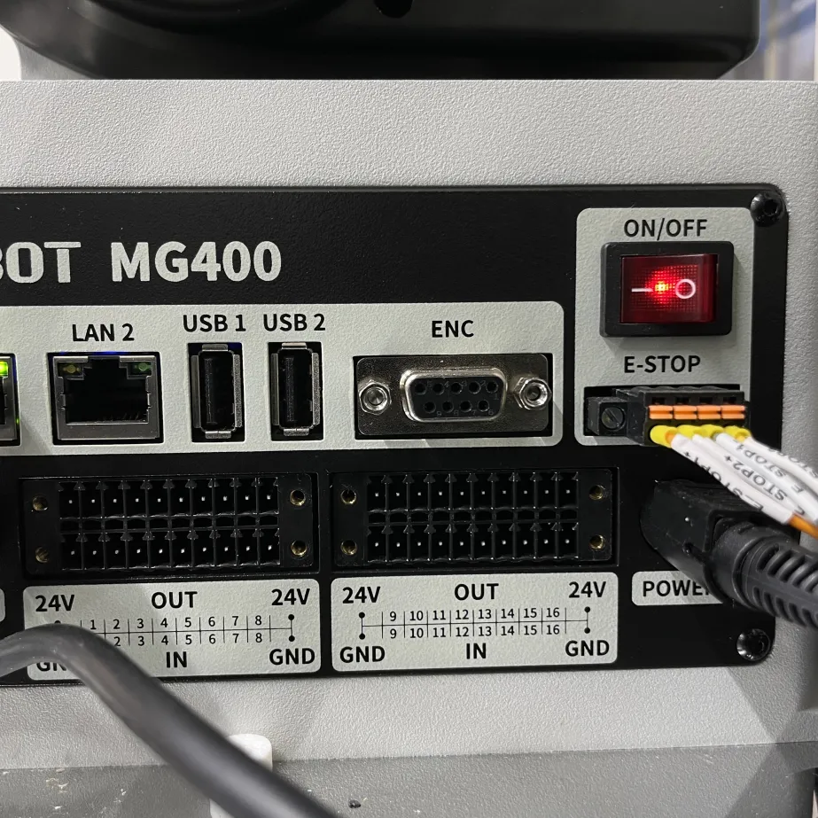
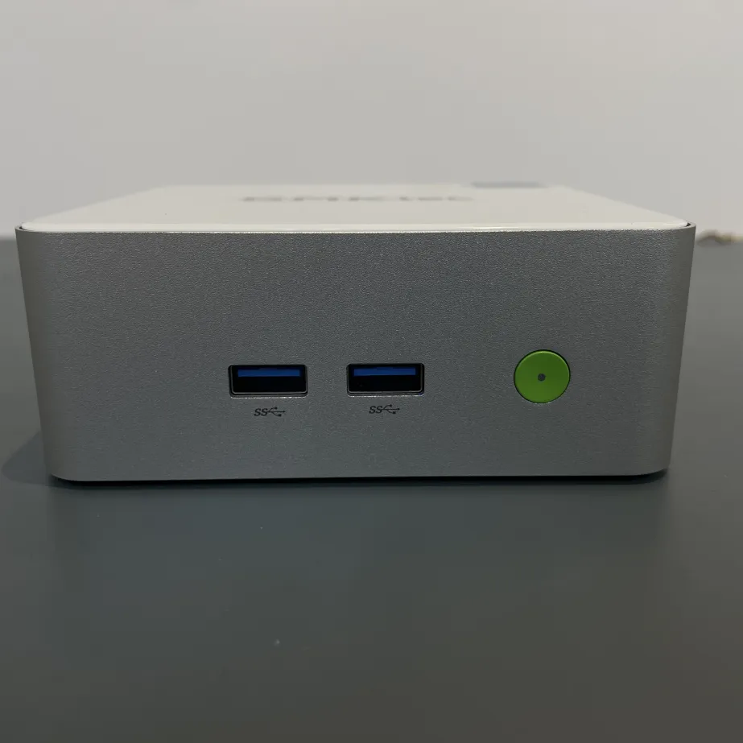

# 1. ハードウェアマニュアル

## 目次
- [電源の入れ方](#電源の入れ方)
- [土台と周辺部品・機器の説明と配置について](#土台と周辺部品機器の説明と配置について)
- [配置について](#配置について)
- [トラブルシューティング](#トラブルシューティング)

ご使用いただく自動化機器には大きくわけて3つのハードウェアがあります。
- ロボットアーム
- 本体

また、以下の周辺機器が付属します。
- 非常停止スイッチ 
- 土台アタッチメント

## 電源の入れ方

ロボットアームの土台側面にある赤色の電源スイッチを「ON」の位置に切り替えます。電源がついた時は、土台の角にあるライトが光ります。 
 

  

    💡 <strong>Tips:</strong> かならず緊急停止ボタンが上に上がった状態であることを確認してください。 
    下がっている状態であるときは、矢印の時計回りの方向に回すことで、ボタンを上にあげてください。
  

本体の緑色のボタンを押して本体を起動します。電源がつくと中心が白く光ります。 
 

## 土台と周辺部品・機器の説明と配置について

**土台アタッチメント** 
こちらは複数の穴があいています。この穴に合わせて、ウェルプレート用部品やチップケース用部品の下面にある隆起部分を合わせることで、部品を土台の上で**固定できます**。

**周辺アタッチメント・機器** 
アタッチメントとしては、ウェルプレートなど用に設置できるケースやロボットアームの先にある先端アタッチメントがあります。 それだけでなく、**緊急停止ボタン**もついております。これはロボットが動いているときに押すと止めることができます。

緊急停止ボタンは、ロボットアームが動いている最中に停止させたい時に利用します。押すと**けたたましいエラー音がなります**が、冷静にご対応ください。押したあとは二つのことを**順に**していただくと再度ロボットが使えるようになります。

1. 赤いボタンを矢印と同じ向きの時計回りに回します。このようにするとボタンが元の位置に戻ります。
2. その後、ソフトウェア側の「アラーム発生」をクリックし、アラームをクリアする。

順番を仮に間違えてしまった場合は、再度順番通りに実施すると元に戻ります。

### 周辺部品の交換方法

### 配置について
配置については個別のプロトコルに合わせて配置してください。
 
もしかして、[コロニーピッキング](protocol/colonypicking.md)

## トラブルシューティング

ハードウェアに関する一般的な問題と解決策については、以下をご確認ください。

  

    
電源が入らない

    

      <strong>確認事項：</strong> 電源ケーブルの接続 
      <strong>対処法：</strong> ✅ ケーブルを再接続してください
    

  

  

    
アームが動かない

    

      <strong>確認事項：</strong> ソフトウェア接続状態 
      <strong>対処法：</strong> ✅ 接続を再確立してください
    

  

  

    
異音がする

    

      <strong>確認事項：</strong> アタッチメントの取り付け 
      <strong>対処法：</strong> ⚠️ 正しく取り付け直してください
    

  

## クイックナビゲーション

  <a href="readme.html" style="display: block; padding: 10px 15px; background: #3498db; color: white; text-decoration: none; border-radius: 5px; min-width: 150px; text-align: center;">
    📖 メインガイド
  </a>
  <a href="hardware.html" style="display: block; padding: 10px 15px; background: #e74c3c; color: white; text-decoration: none; border-radius: 5px; min-width: 150px; text-align: center;">
    🔧 ハードウェアマニュアル
  </a>
  <a href="nodesdetails.html" style="display: block; padding: 10px 15px; background: #2ecc71; color: white; text-decoration: none; border-radius: 5px; min-width: 150px; text-align: center;">
    🧩 ノード詳細ガイド
  </a>
  <a href="protocol/colonypicking.html" style="display: block; padding: 10px 15px; background: #9b59b6; color: white; text-decoration: none; border-radius: 5px; min-width: 150px; text-align: center;">
    🧪 コロニーピッキング
  </a>

