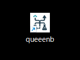
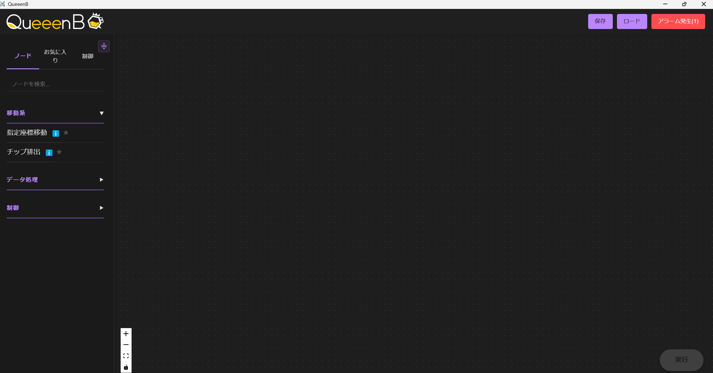
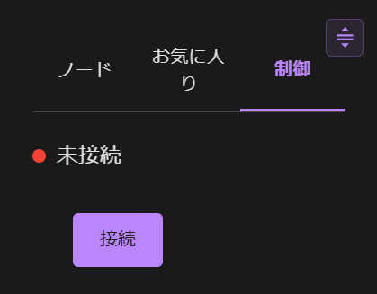
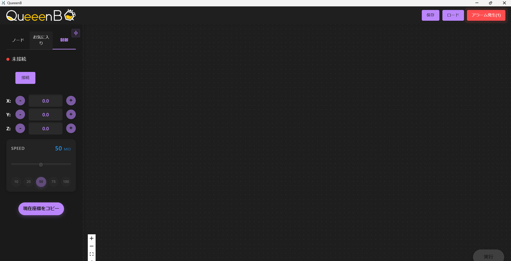
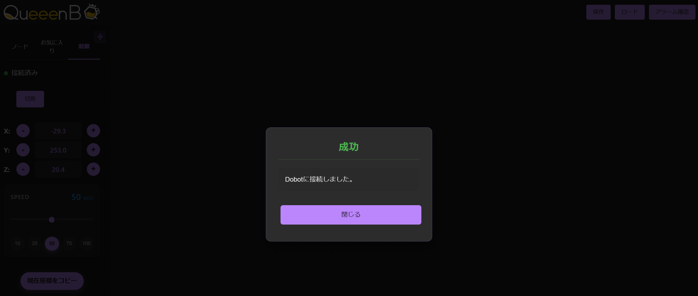
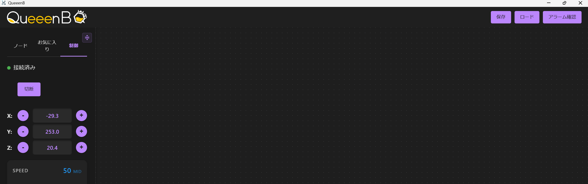
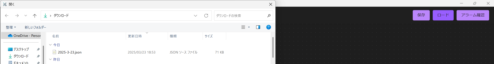
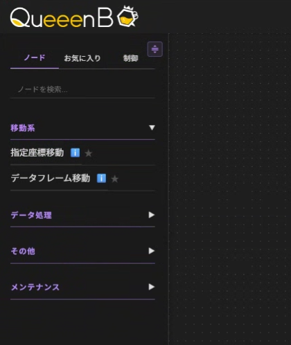

# 2. ソフトウェアマニュアル

## 目次
- [リモートアクセス](#リモートアクセス)
- [アプリケーションとロボットを立ち上げて、両者を接続する](#アプリケーションとロボットを立ち上げて両者を接続する)
  - [デスクトップアイコンの起動](#1-デスクトップアイコンの起動)
  - [接続](#2-接続)
- [自動化を行う](#自動化を行う)
  - [自動化プロトコルを準備する](#1-自動化プロトコルを準備する)
  - [自動化プロトコルを実行する](#2-自動化プロトコルを実行する)
  - [通知機能をオンにする](#3-通知機能をオンにする)
- [アップデート方法](#アップデート方法)
- [トラブルシューティング](#トラブルシューティング)

## リモートアクセス

別PCからアクセスする場合は、同一ネットワークに接続したうえで以下のURLにアクセスします。

```
http://queeenb.local:5000
```
> **注意**
> 
> 複数のPCから同時にアクセスしないでください。システムの誤動作の原因となります。


## アプリケーションとロボットを立ち上げて、両者を接続する
### 1. デスクトップアイコンの起動
デスクトップにあるアイコンをダブルクリックします。 <br> 
<br>

アプリケーションが開くと下記のような状態になります。<br>
<br>


> **注意**
> 
> アイコンを押すと黒いウィンドウ（ターミナル）がでてきますが、こちらは閉じるボタンを押さずに、最小化ボタン押してください。
<br>

### 2. 接続
まずロボットを起動するために、向かって右にある赤いボタンを押します。<br>
<br>

左上の三つのボタンから「制御」のボタンをクリックして下記のページに移動します。<br>
<br>


左上のバーの中に「接続」というボタンを押してください。<br>


<br>
<br>

下記のように「成功」と表示されれば接続は完了です。<br>


<br>


## 自動化を行う
自動化を行うためには大きく分けて二つの動作が必要です。

- 自動化のプロトコルをノードなどを用いて図表化する
- 実行ボタンを押し、四隅を確認した後に、ループ回数を入力する

### 1. 自動化プロトコルを準備する
#### a. テンプレートかされた自動化のプロトコルを使う（配布されているjson ファイルを使って自動化を実施する）
配布された自動化プロトコルを実行する際には、右上にある「ロード」ボタンを押します。<br>

<br>

そうするとファイルを選択する画面へと切り替わるので、配布されたjson ファイルを選択します。<br>

<br>

これで自動化プロトコルを図表化して用意できました。

#### b. 自分で自動化のプロトコルをノードを用いて図表化する
自分で自動化のプロトコルを作成する際にはまず左側の三つのボタンの「ノード」のページに移動して下さい。
まずは「ノード」に関して説明します。

>*ノードとは？*<br>
>このアプリケーションではロボットの動作の一つ一つを「ノード」として図表化することで実施ができます。

ノードを用いて自分だけの自動化プロトコルを作ってみましょう。<br>
たとえば右側の中にある「移動系」をクリックすると 「指定座標移動」と「チップ排出」というノードを追加することができます。追加するためには、追加したいノードを押しながらドラッグアンドドロップを右側のドット方眼の方に追加してみましょう。<br>
<br>
<br>
<video width="640" controls>
<source src="videos/discrip-ver1.0-draganddrop.mp4" type="video/mp4">
お使いのブラウザは動画の再生に対応していません。
</video><br>

左側のノードを追加して組み合わせることでにあるノードを組み合わせて自分だけの自動化のプロトコルを作ることができます。

詳しいノードの説明は下記のページに記載されています．
[ノード詳細ガイド](nodesdetails.md) 

また一旦すべてのノードを消したいときは、右上のボタンであるクリアを押してください。


### 2. 自動化プロトコルを実行する
自動化のプロトコルがノードによって表現できたあとは実行です。

右下の実行ボタンを押すことで実際にロボットがノードに従って自動化のプロトコルを実施します。
<br>
<video width="640" controls>
<source src="videos/discrip-ver1.0-execution.mp4" type="video/mp4">
お使いのブラウザは動画の再生に対応していません。
</video>
<br>

実行中に急遽ロボットを止めたいときは、実行の隣の一時停止ボタンをおして対応してください。


このとき、「続行する」を選んだ際には止めた次のノードから順次実行していきます。
「キャンセルする」を押した際には*次のノードを実行した後に*終了します。キャンセルの際には周りにいないようにお願いします。


### 3. 通知機能をオンにする

<br>
制御ページに移動すると、左下に通知機能をオンにすることができます。

具体的にはメール通知を有効にするをチェックし、メールアドレスを入力して「保存」を押します。
<br>

<br>
こちらを実施したのちは、自動化のノードを実行し終わる度に入力したメールアドレスにて通知が行きます。
<div style="border-left: 4px solid #ffd700; background:rgb(230, 210, 172); padding: 15px; margin: 20px 0; border-radius: 5px;">
  <p style="margin: 0; font-size: 1.1em;">
    💡 <strong>Tips:</strong> <br>
    保存の右のテスト送信を行うことで実際に届くかどうか確認することができます！<br>
  </p>
</div>

## アップデート方法

1. 公式サイトから最新のzipファイルをダウンロードします。
2. ダウンロードしたzipファイルを展開します。
3. 展開したフォルダを、デスクトップにドラッグアンドドロップします。
4. 「置き換え」を選択して更新を完了します。
<br>
<video width="640" controls>
<source src="videos/update.mp4" type="video/mp4">
お使いのブラウザは動画の再生に対応していません。
</video>

<br>
## トラブルシューティング

### 問題1: アプリケーションから接続に失敗する・接続できない

<div style="border-left: 4px solid #e74c3c; background: #fadbd8; padding: 15px; margin: 20px 0; border-radius: 5px;">
  <details>
    <summary style="font-weight: bold; cursor: pointer;">本体は起動していますか？</summary>
    <div style="padding: 10px 20px;">
      ✅ ロボットの本体の電源を確認する<br>
      ✅ ロボットとPCのケーブルが抜けていないか確認する
    </div>
  </details>
  
  <details>
    <summary style="font-weight: bold; cursor: pointer;">アプリケーションは起動していますか？</summary>
    <div style="padding: 10px 20px;">
      ⚠️ 一度すべてのウィンドウを閉じ、アプリケーションを再起動してみてください。
    </div>
  </details>
</div>

### 問題2: 別PCからアクセスできない

<div style="border-left: 4px solid  #e74c3c; background: #fadbd8; padding: 15px; margin: 20px 0; border-radius: 5px;">
  <details>
    <summary style="font-weight: bold; cursor: pointer;">（制御用PC）ネットワークに接続されていますか？</summary>
    <div style="padding: 10px 20px;">
      ✅ 制御用PCをWi-Fi経由でネットワークに接続してください。
    </div>
  </details>
  
  <details>
    <summary style="font-weight: bold; cursor: pointer;">（操作用の別PC）制御用PCと同じネットワークに接続されていますか？</summary>
    <div style="padding: 10px 20px;">
      ⚠️ 別ネットワークからのリモート操作はセキュリティの観点からできません。<br>
      ✅ 同じネットワークに接続してください。
    </div>
  </details>
  
  <details>
    <summary style="font-weight: bold; cursor: pointer;">同一LAN内での相互アクセスが許可されていますか？</summary>
    <div style="padding: 10px 20px;">
      ⚠️ お使いのネットワークの管理者にご確認ください。
    </div>
  </details>
</div>

## サポート情報
製品のご意見やフィードバックは[こちら](https://forms.gle/KhQCS1gYCF6BUkbf7)にご投稿ください。<br>
問題が発生した場合は、info( at mark) queeen-b.com までご連絡ください。


## クイックナビゲーション

<div style="display: flex; flex-wrap: wrap; gap: 10px; margin-bottom: 20px;">
  <a href="" style="display: block; padding: 10px 15px; background: #3498db; color: white; text-decoration: none; border-radius: 5px; min-width: 150px; text-align: center;">
    📖 メインガイド
  </a>
  <a href="hardware.html" style="display: block; padding: 10px 15px; background: #e74c3c; color: white; text-decoration: none; border-radius: 5px; min-width: 150px; text-align: center;">
    🔧 ハードウェアマニュアル
  </a>
  <a href="software.html" style="display: block; padding: 10px 15px; background: #f39c12; color: white; text-decoration: none; border-radius: 5px; min-width: 150px; text-align: center;">
    💻 ソフトウェアマニュアル
  </a>
  <a href="nodesdetails.html" style="display: block; padding: 10px 15px; background: #2ecc71; color: white; text-decoration: none; border-radius: 5px; min-width: 150px; text-align: center;">
    🧩 ノード詳細ガイド
  </a>
  <a href="protocol/colonypicking.html" style="display: block; padding: 10px 15px; background: #9b59b6; color: white; text-decoration: none; border-radius: 5px; min-width: 150px; text-align: center;">
    🧪 コロニーピッキング
  </a>
</div>
   
